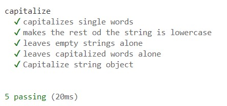

# Testing-In-Node
A simple Node.js app created to demonstrate unit testing with Mocha and Chai. This app includes a capitalize function that capitalizes the first letter of a given string and is tested for different edge cases to ensure functionality.

